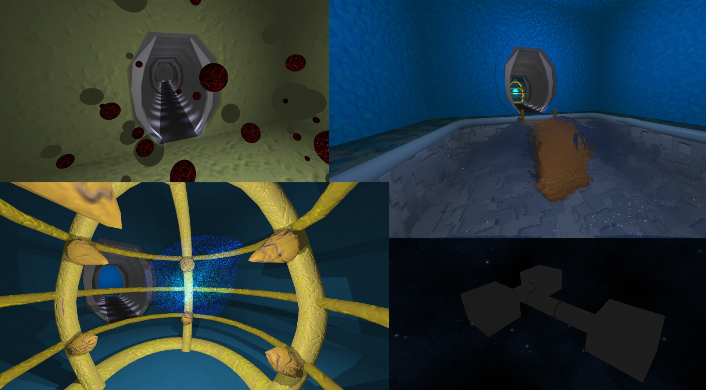
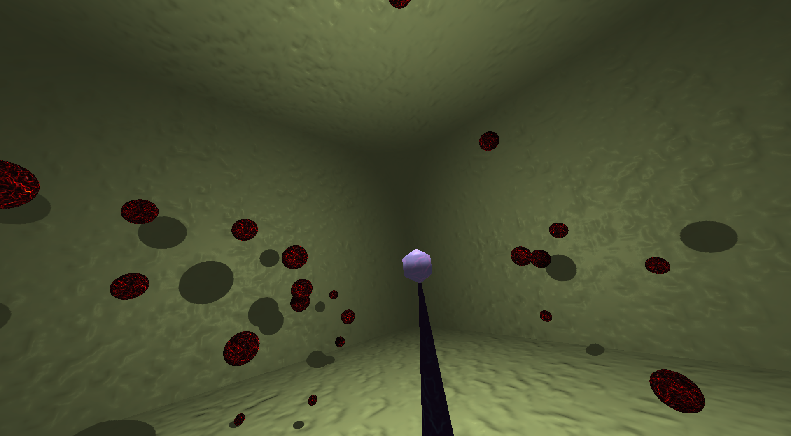
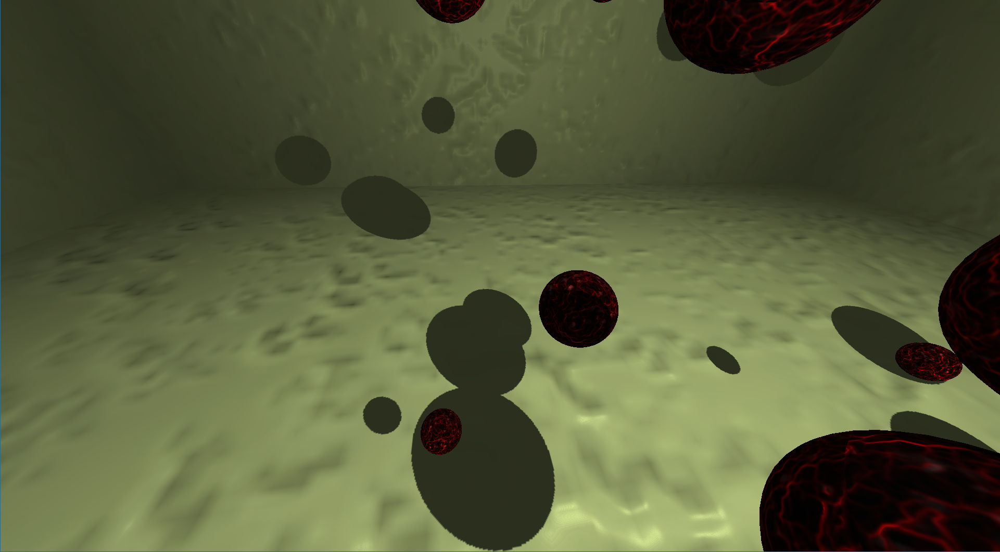
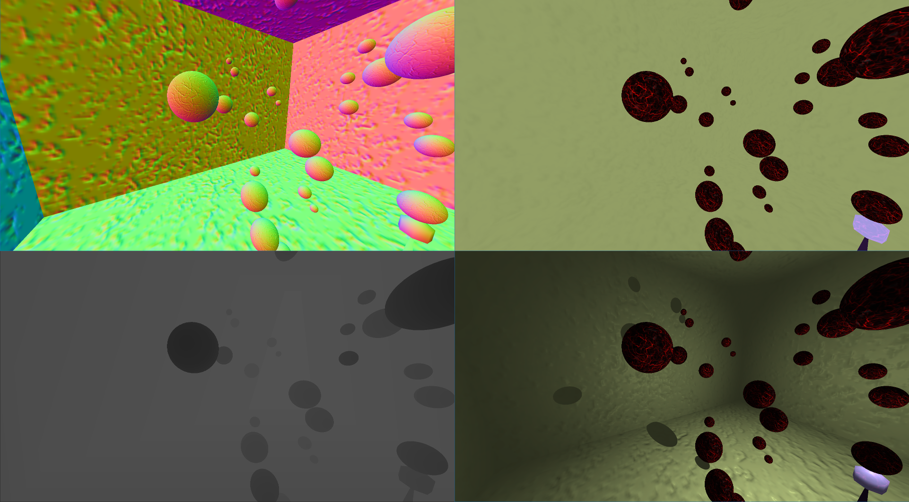
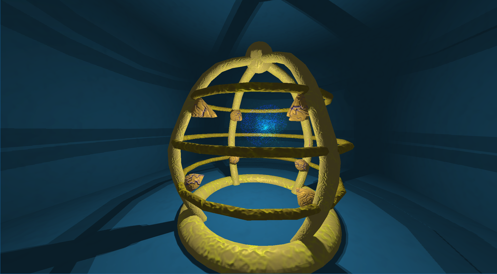
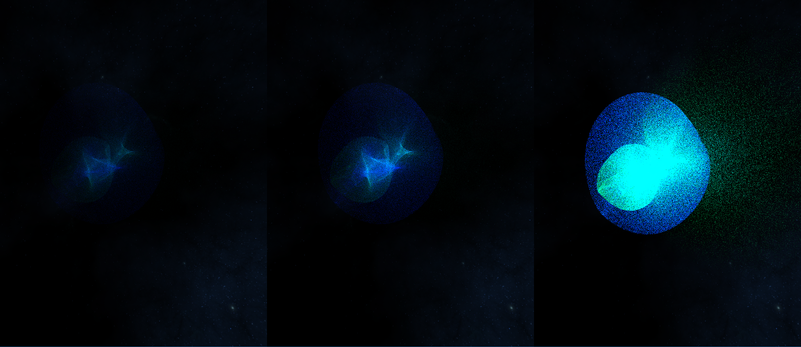
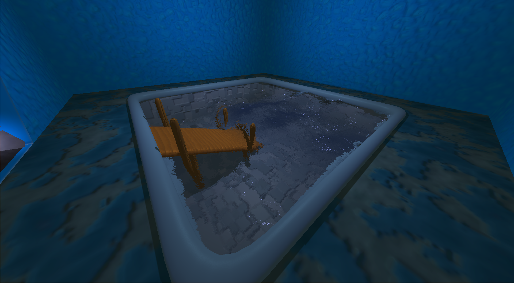
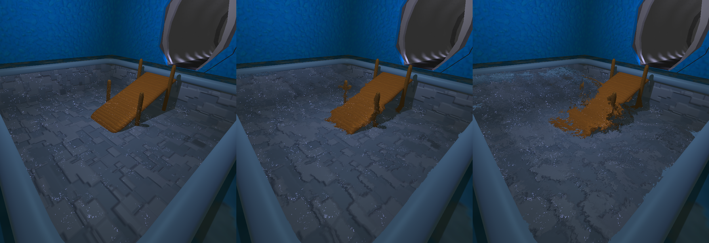
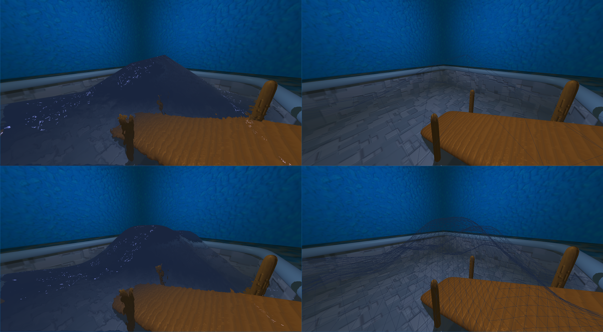
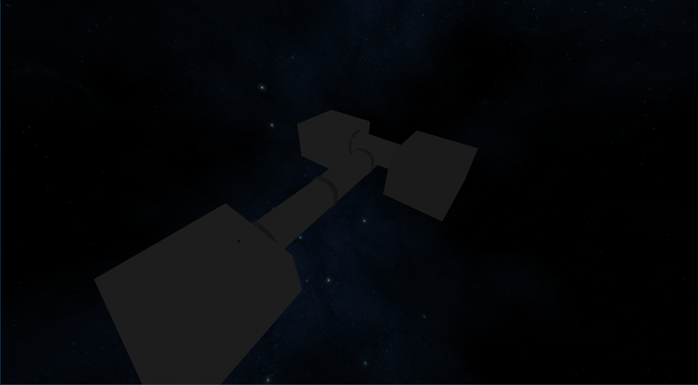

DV1542
==========

This is a implementation of a 3D renderer engine, done as part of a project in a course in 3d programming. It implements a wide range of techniques from lights & shadows to utilizing the GPU for general computation with compute shaders. Some of the implemented techniques are:

* __Bump mapping__
  This is used to make a flat surface appear bumpy without adding more triangles, instead the surface normals are modified by a texture.
* __Deferred shading__
  By rendering all information for shading the scene to different textures, in my case I rendered the objects normals, diffuse colour and depth. Lights can later use these textures for shading. This method enables using more lights in the same scene (it scales _O(N+M)_ instead of the traditional _O(N*M)_. Its big downside is that it uses much more bandwidth compared to regular forward rendering.
* __Compute shaders__
  This is a special program that is run on the GPU utilizing its parallel computing power for general purpose.
* __Point light shadows__
  I render the shadow cast from point lights to a cube texture, I utilize geometry shadows for splitting geometry to several layers, enabling me to render to all sides of the cube textures at once.
* __Water__
  The water that I render is created in a two step process. The first step is a basic simulation using compute shaders for creating the surface height, this is then saved to a texture. In the second step the water is rendered as a post effect, utilizing the shaded texture of the complete scene to create a refraction effect.
* __Tessellation__
  By using tessellation I can use dynamic resolution for water rendering. I base the resolution on the distance to the camera. This allows using few triangles if you look at it from a distance, and as you move closer to it, higher tessellation is used making the surface.
* __Camera__
  The camera is able to move in 6 degrees of freedom, using WASD for moving and mouse for looking around. The mouse wheel can rotate the view.
* __Frustum culling__
  I use frustum culling to discard objects that are out of view. For this task I use a loose octree, to be able to discard large portions of the scene all at once. The octree is dynamically reconstructed when needed (for example when the spheres in room 1 is moving to the next cell)

The scene is split into 3 rooms that are connected by corridors. Each room is designed to show of a single technique.

## Room 1 - Moving Spheres
This room contains a pedestal in the middle, that has a point light sitting on top. Moving around the pedestal is a number of spheres, those shadows is cast on the walls of the room.

A view on the room with a pedestal in the middle.

Closer look on the shadows

The textures used in the g-buffer used in deferred rendering. From top-left to bottom-right:
Normals, diffuse (colour), depth and the shaded end product.

## Room 2 - Particles
This room contains a *cage* with a particle system inside of it. The particles are driven by two simple rules. The first one is a limited lifetime (by default 10 seconds), the second is that they are attracted to some moving attractor points. The strength of this attraction is a function based on their distance to said point. This whole simulation is driven by the GPU with compute shaders. By using the GPU I can simulate a couple of millions of particles. I've tried simulated up to around 5million particles and the simulation was running smooth, however I stopped there since the rendering become to expensive.

This is about 2 million particles outside of the room to better show each individual particle. The left most image is rendered with low intensity, the right with the highest and then middle have a intensity in between. Each particle is only a single pixel in size, but together they can create some amazing patterns and it can be very hypnotic seeing them move and change pattern.

## Room 3 - Water
The last room contains a pool with a wave simulation inside. This room is probably the one I had the most fun implementing and I learnt allot about what it is that make water look like water. There are two parts of rendering water, the first part is specular reflections - this is what makes water look shiny. The second part, and in my opinion the important one, is refraction - then light passes thru water it bends making whatever it is behind the water look distorted.
The only way I know of that can mimic that effect is with ray tracing. However since GPU's are optimized for the opposite, they work by projecting the meshes to the screen, instead of tracing rays from the screen into the scene. So I came up with a alternative way, by rendering the water as a post effect. By combining the water normal and depth of the scene I distort the shaded scene to fake a refraction effect.
I also used a tessellation shader to dynamically tessellate the water surface. This makes the water appear smooth up close, without using too many small triangles when you are far away.

Different levels of refraction, the left most image has no refraction, the other two have different levels of refraction.

The left column shows the surface, the right one its wireframe. The upper row is with low tessellation, the lower one with a high.

The station from the outside. The background is a skybox of stars.

### Code can be found [here](//github.com/Visse/dv1542_project) and other projects [here](../index.md)
