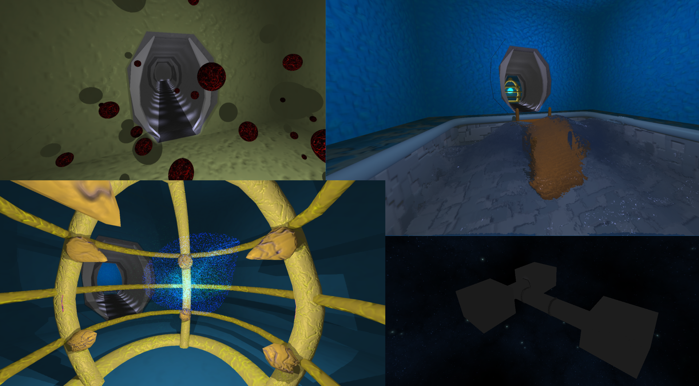

Portfolio
==========

#### 1. DV1542 Demo
This was a project for a course in 3D programming. It is a 3d rendering engine with the purpose to learn about different techniques used in games and other 3d applications. I choose to implement the following techniques in a space setting. Its implemented as 3 different rooms connected by corridors. Each room is designed to demonstrate a set of techniques.

**Room 1** have a single point light in the middle, and spheres that move around the room. The spheres cast a shadow on each others and the walls.

**Room 2** is a pool with simulated water waves. The waves are simulated as a sum of sin waves in a compute program running on the GPU.

**Room 3** in this room I've placed a GPU driven particle system each particle is driven by a simple rule - accelerate towards several attractor points, as a single particle its not so impressive, but since they are driven by the GPU, I can have thousands, up to around 2-3 million particles alive at any one time.

### [More info + images](dv1542/index.md)

-------------------------------------------
