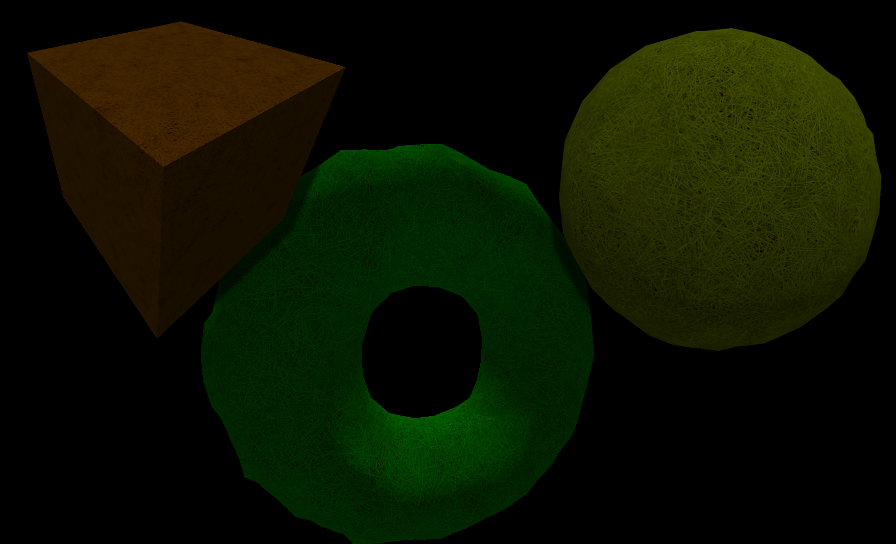
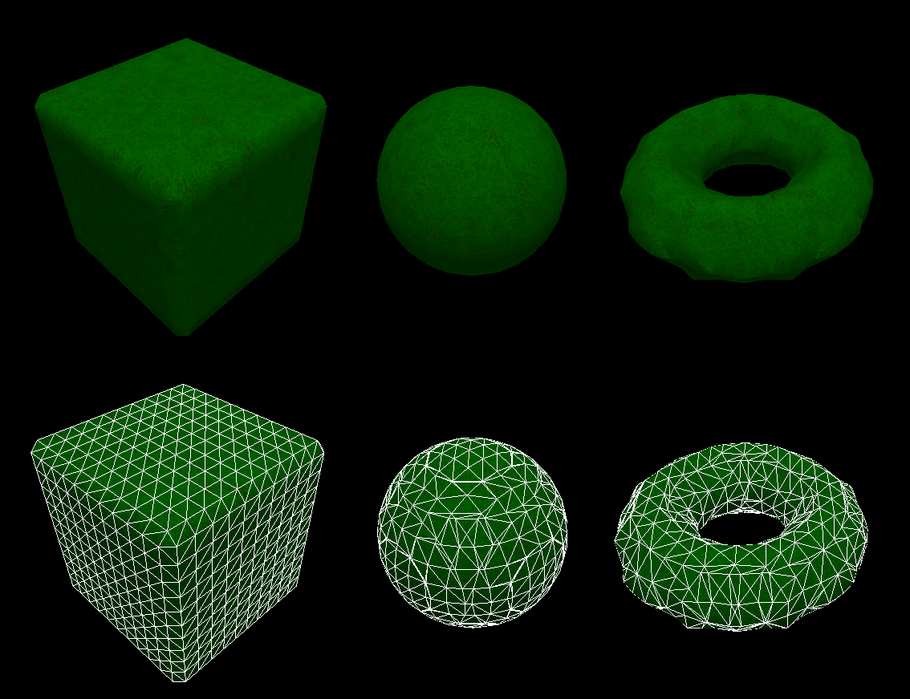
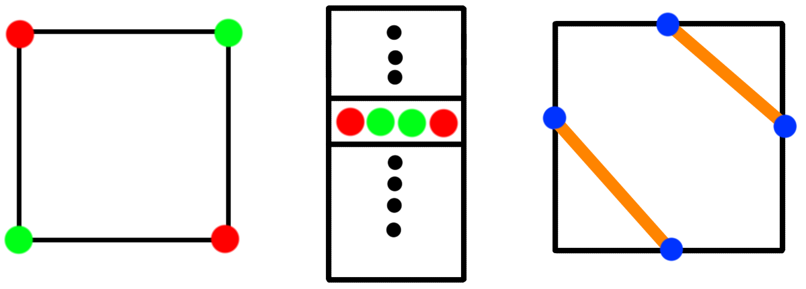
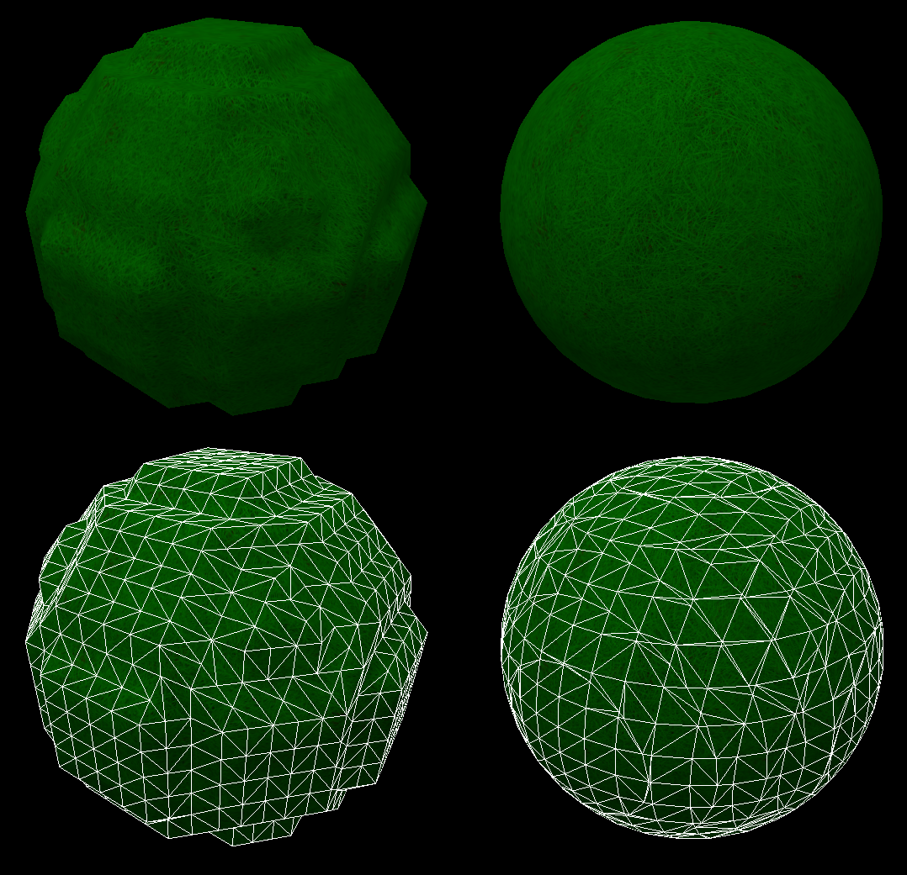
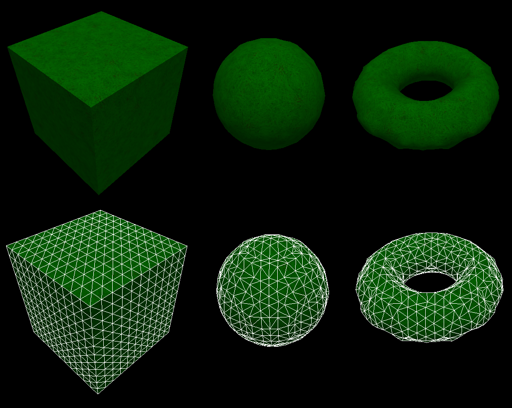
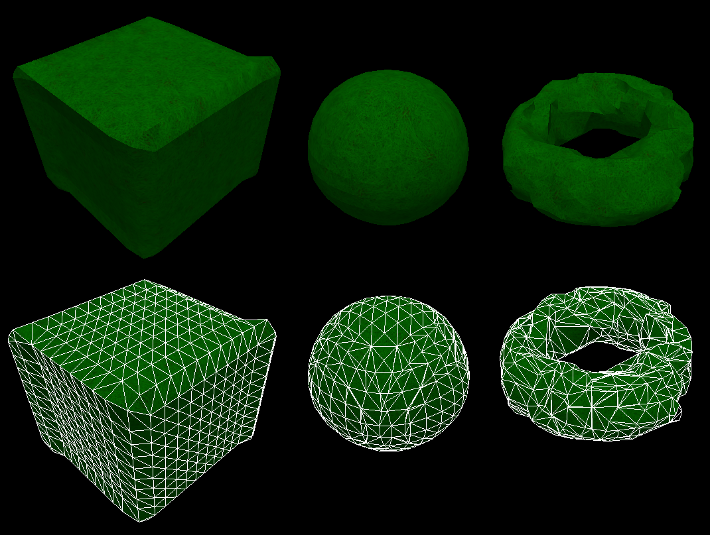
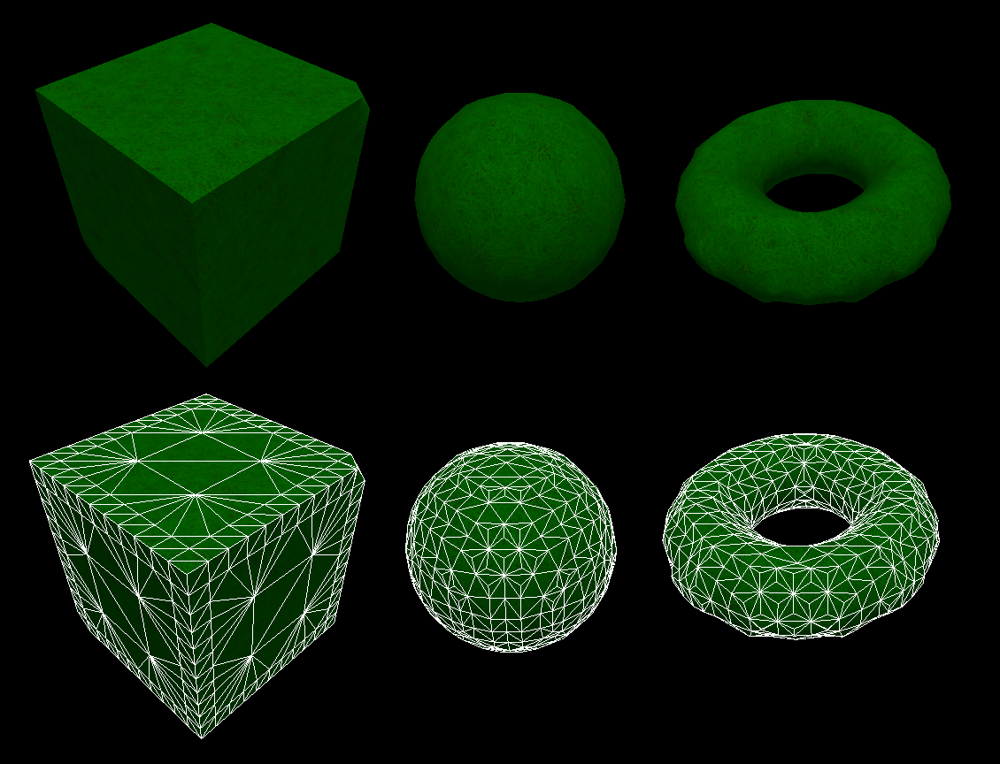

Volume - **WIP**
==========
<script type="text/javascript" src="//cdn.mathjax.org/mathjax/latest/MathJax.js?config=TeX-AMS-MML_HTMLorMML"></script>

[](../volume_preview.png)

## Table of content
1. [Introduction](#introduction)
2. [Implemented Algorithms](#implemented-algorithms)
  * [Marching Cubes](#marching-cubes)
  * [Dual Contouring](#dual-contouring)
  * [Dual Contouring Marching Cubes](#dual-contouring-marching-cubes)
  * [Adoptive Dual Contouring](#adoptive-dual-contouring)
3. [Other Algorithms](#other-algorithms)
  * [Dual Marching Cubes](#dual-marching-cubes)
  * [Manifold Dual Contouring](#manifold-dual-contouring)
  * [Surface Nets](#surface-nets)
4. [Supported primitives](#supported-primitives)
5. [Terms](#terms)


# Introduction

This is part of a bigger project but I think its worth showing by its self. Its a collection of different algorithms for constructing [implicit surfaces](https://en.wikipedia.org/wiki/Implicit_surface).
First a short introduction to each algorithm.

**Marching Cubes (MC)** This is probably the most famous of these algorithms. Its was developed in 1987 for reconstruction 3d surfaces. It works on a uniform grid with each corner being assigned a value. It when iterates each cell and check the edges. Based on the result of the check it looks up the resulting mesh in a case table. The algorithm is very simple to implement and fast - the hardest part is to create the case table. It had several downfalls, it couldn't represent sharp edges and it generated a mesh with far from perfect triangulation. It is still used today for its simplicity and speed.

**Dual Contouring (DC)** was a mayor improvement over *MC*, it could not only handle sharp corners, it also (in most cases) generated a better surface representation using fewer triangles. It could do so by being able to place vertexes inside of cells, instead of on the edges between them like *MC* did. However it have a mayor downside in that the surface its generates is not guaranteed to be manifold. To solve this 2 new algorithms was presented in 2004, both with the name Dual Marching Cubes.

**Dual Contouring Marching Cubes (DCMC)** was named *Dual Marching Cubes* in the paper that presented it, but to make it easier to differentiate it from the other similary named algorithm I call it *DCMC*. My reason is how the algorithm works. It uses a similar method as *DC* to place it vertexes, but it runs a *MC* variant to connect the vertexes together, (therefor I gave it the name *DCMC*).

**Adoptive Dual Contouring**

**Dual Marching Cubes (DMC)** was the other algorithm presented, it extends *DC* by allowing multiple vertexes in each cell. More specifically it places a vertexes for each patch generated by the original *MC*. The surface that this algorithm generates is the topology dual to the surface generated by *MC*. Since the original *MC* generated manifold meshes so does *DMC*.

**Manifold Dual Contouring (MDC)** extends *DMC* to generate adoptive surface. This adoptive surface have several nice properties such as being manifold. The method proposed in the paper can also simplify surfaces close together without loosing the surface topology (connecting the surfaces together).

# Implemented Algorithms
Before I describe the algorithms, I think it would be helpful to know what data structures I use.
First we have our sample struct, it stores (as the name suggests) samples from our volume function. Each sample has a value in the range $$[-1,1]$$, where 1 is inside the volume, and -1 is outside. The surface of this volume is at 0.
```c
struct Sample {
  float value;
  float normal[3];
  uint16_t material;
}
```
Each sample is quite small with its 20 bytes (including padding), but we can do better. By storing compressed samples, and uncompressing on the fly, we can go down to storing 8 bytes.
```c
struct CompressedSample {
  uint16_t value, material;
  uint32_t normal;
}
```
Here value is compressed by storing it as fixed precision and the normal is compressed down using 10 bytes for each component.
This may seam like a small thing but I found it quite important since the number of samples grow with the cube of the size for the volume.

## Marching Cubes
[](marching_cubes.png)

Marching Cubes is a algorithm developed in 1987. This is probably one of the most famous of these algorithms and is still in use today since its both easy to implement and very fast.
It works on data in a uniform grid, where the value of the function $$f(p)$$ is sampled at the corners of this grid. For each cell in the grid, it checks if the corners if any of the 8 corners of the cell is inside the volume. Based on what corners are inside the volume, a case is selected from a lookup table to generate a triangulation.

The basic algorithm can be written as:
```c
for cell in grid do
  c = 0
  for corner in cell do
    if corner in volume do
      c |= (1 << corner_index)
  triangulation = lookup_table[c];
```

[](marching_cubes_table.png)
A image over the 3 steps in the algorithm. First find out if the corner is inside (green), or outside (red). Use the result to lookup the vertexes (blue) and its triangulation (orange).

Vertex placement can be improved by instead of placing the vertex in the middle of a edge, use the fact that we every corner have a value. If we linearly interpolate this value over the edge we can find the point there the value is 0 and place the vertex there. You can find where on the edge to place the vertex by first calculating $$x = \frac{v_1}{v_1 - v_2}$$ and then the position with $$p = p_1 + (p_2-p_1) * x$$. Where $$a_i$$ and $$p_i$$ is the value and position for the first and second corner. As long as $$sign(v_1) != sign(v_2)$$ (that is, the edge exhibit a sign change) $$x$$ will be in the range $$[0, 1]$$ and wherefore $$p$$ lie on the edge between $$p_1$$ and $$p_2$$. By using interpolation you usually get a better surface that represents the volume function better.

[](marching_cubes_interpolate.png)
A comparison of a sphere, created without vertex interpolation (left) and with (right). Bottom row shows the corresponding wireframe.

The algorithm has a couple of shortfalls. The first one is that it cannot recreate sharp corners and the second one is that the triangulation it creates are far from a good one, with lots of thin long triangles (especially when using interpolation) and that it creates a lot more triangles than are necessary, most notable on flat surfaces.


#### Resources:
* [Marching Cubes: A high resolution 3D surface construction algorithm](res/Lorensen_marching_cubes.pdf)
* [Efficient implementation of marching cubes' cases with topological guarantees](res/Efficient_implementation_of_marching_cubes_cases_with_topological_guarantees.pdf)

## Dual Contouring
[](dual_contouring.png)

This was the second algorithm that I choose to implement. It have several benefits over *MC*, the first one is that it places vertexes inside of the cells instead of on the edges, second one is that it usually creates a better triangulation with each triangle being roughly the same size. Another benefit is that it can reproduce sharp edges. It does it by working on so called 'hermite data' - or in simpler terms - in addition to storing the value of the volume function, it stores its gradient.

*DC* uses a method first introduced by a paper on surface simplification by utilizing a quadric error function (*QEF*). The *QEF* takes a set of planes defined by their normal $$n_i$$ and the vertex position $$p_i$$ and finds a point that minimizes the distance to those planes. Or in math terms - minimizes the function
\\[E(x) = \sum_i (n_i \cdot (x - p_i))^2\\]
This function can represented in matrix notation where $$A$$ is a matrix whose rows consists of normal for the planes $$n_i$$ and $$B$$ is a vector whose entries are $$p_i \cdot n_i$$.
\\[E(x) = (Ax-B)^T(Ax-B)\\]
It turns out you can store this version of $$E$$ in constant memory by utilizing that
\\[E(x) = x^TA^TAx -2x^TA^TB + B^TB\\]
and only store the matrixes $$A^TA$$, $$A^TB$$ and $$B^TB$$, resulting in only needing to store 10 quantities, regardless how many planes there is.
The sought after point $$x$$ can then be acquired by finding the peusudo inverse of $$A^TA$$ (written as $$(A^TA)^+$$), and using it to solve
\\[[x = (A^TA)^+A^TB\]]

Resources:
* [Dual contouring of hermite data](http://www.lsi.upc.edu/~pere/PapersWeb/SGI/DualContouring.pdf)
* [Dual contouring: The secret sauce](http://hyperfun.org/FHF_Log/Schaefer_DualSecret_TR02408.pdf)
* [Surface simplification using quadric error metrics](https://cg.informatik.uni-freiburg.de/intern/seminar/meshSimplification_1997_Garland.pdf)

## Dual Contouring Marching Cubes
[](dual_contouring_marching_cubes.png)

Resources:
* [Dual marching cubes: Primal contouring of dual grids](Dual marching cubes: Primal contouring of dual grids)

## Adoptive Dual Contouring
[](adoptive_dual_contouring.png)


------------------------------

# Other Algorithms


## Dual Marching Cubes

Resources:
* [Dual Marching Cubes](http://vis.computer.org/vis2004/dvd/vis/papers/nielson2.pdf)

## Manifold Dual Contouring

Resources:
* [Manifold dual contouring](http://faculty.cs.tamu.edu/schaefer/research/dualsimp_tvcg.pdf)

## Surface Nets
I don't know much of this method, other than that many of the other algorithms refer to it. Because of that I would like to research more about it and try to implement it someday.


------------------------------
# Supported Primitives
Currently I support the following spheres, cubes, planes and torus. They can be combined using unions, intersection and exclusion.

## Sphere
The sphere is defined by the function $$f(x,y,z) = x^2 + y^2 + z^2 - r^2$$, there $r$ is the radius of the sphere. Its normal is the vector $$\frac{(x,y,z)}{||(x,y,z)||}$$.

## Cube

## Plane

## Toros

------------------------------
# Feature Work

------------------------------
# Terms

**Iso Surface** An iso surface is defined by the function $$f(p) = 0$$. For example the function $$f(x,y,z) = x^2 + y^2 + z^2- r^2$$ represents a sphere with the radius $$r$$.

**Uniform Grid** This is a grid there each *cell* is the same size.

**Octree** This a spatial tree data structure there each cell has 8 children.

**QEF**

### Other Projects can be found [here](../index.md)
